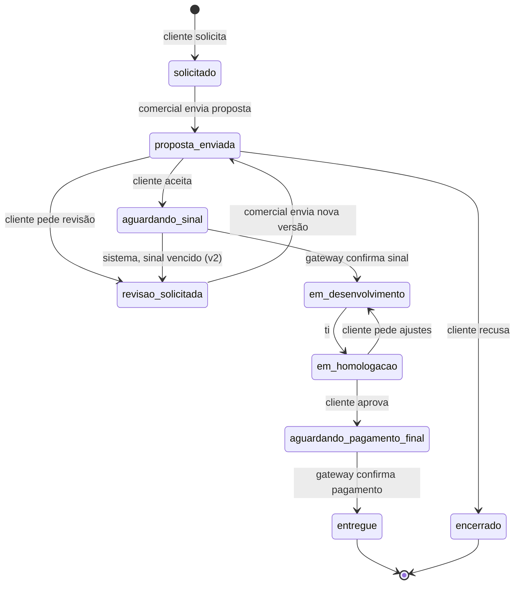
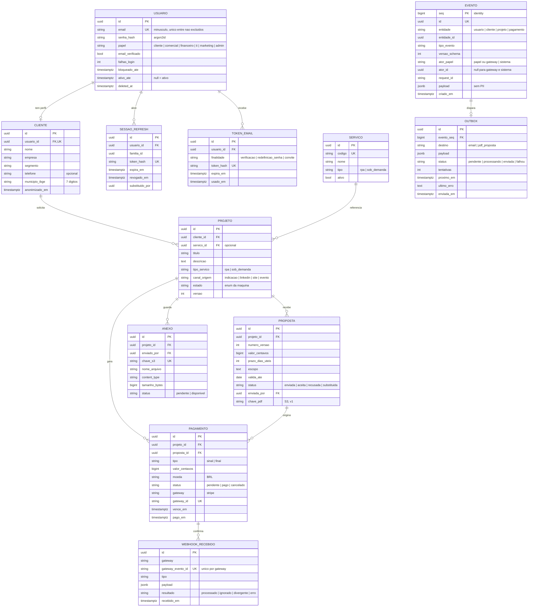
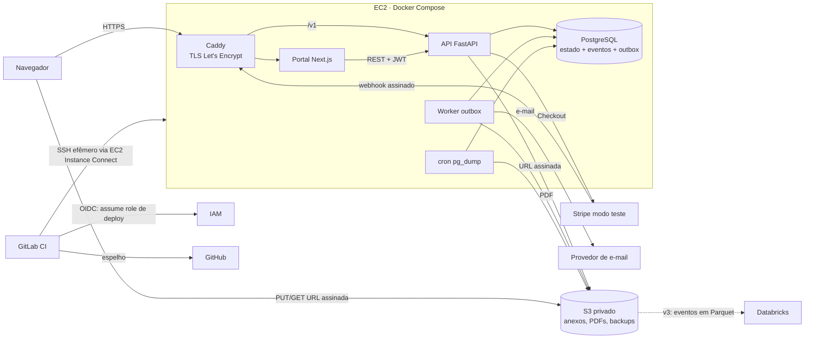

# Ozymandias: especificação do MVP e da v1

Versão do documento: 04/10/2026. Substitui o desenho do `README.md` antigo onde houver conflito
(Firebase, Salesforce, Supabase, GitHub Actions, admin único). Base de mercado:
`docs/pesquisa-de-mercado-2026-10.md`.

## 1. Visão e público-alvo

Ozymandias é a plataforma de uma agência de **automação (RPA)**, com **desenvolvimento sob demanda**
como linha secundária. O cliente se cadastra, solicita um orçamento, recebe no portal uma proposta com
prazo e valor, aceita, recusa ou pede revisão, paga 50% de sinal e 50% na entrega e acompanha o projeto
por seis fases. A equipe interna opera a mesma API com papéis (comercial, financeiro, TI, marketing,
admin). A API é a única dona do estado.

| Público | O que procura no projeto |
|---|---|
| Recrutador e tech lead de banco (Itaú, Bradesco, Santander, BTG, XP) | Regra de negócio com dinheiro, consistência, rastreabilidade, testes |
| Big tech e fintech com escritório no Brasil (Airbnb SP, Google, Stripe, PagBank) | Fundamentos de back-end, produção, comunicação escrita em inglês, uso de IA com julgamento |
| Usuário da demo | Fazer a jornada completa no navegador com cartão de teste |

## 2. Objetivo do portfólio e o que cada parte prova

Objetivo: gerar entrevistas para **back-end Python pleno** em até 3 meses. Vaga júnior é rara (5 de 138
vagas na Gupy, 4%; ~15 de ~9.000 nos quadros internacionais), então o projeto precisa provar
competências de pleno somadas a 1a5m de RPA em produção e 5 anos em esteiras jurídicas de bancos.

| Parte | Prova | Demanda na pesquisa (Gupy, 138 vagas; entre parênteses, só vagas Python) |
|---|---|---|
| API FastAPI versionada | Contrato REST, camadas, validação | APIs REST 88% (87%); FastAPI 23% das vagas Python |
| PostgreSQL modelado + Alembic | Modelagem relacional, constraints, migrations | SQL / relacional 86% (89%) |
| Máquina de estados + `FOR UPDATE` | Concorrência e regra de negócio real, não CRUD | Escalabilidade / resiliência 67% (53%) |
| Stripe + webhook idempotente | Integração externa com dinheiro, assinatura, idempotência | Diferencial "billing" (Afya, Backend Pleno Python) |
| Auth JWT + RBAC | Segurança aplicada | Segurança (OAuth, JWT) 51% (48%); "permissões e controle de acesso" (Samsara) |
| Eventos + outbox + worker | Arquitetura orientada a eventos sem transação distribuída | Mensageria 55% (42%) |
| pytest com Postgres real, teste de concorrência | Testes que pegam bug de verdade | Testes automatizados 71% (78%) |
| GitLab CI/CD com deploy | Esteira completa | CI/CD 64% (72%); Git 62% |
| EC2 + S3 + IAM com OIDC | Nuvem com menor privilégio e custo controlado | AWS 45% (51%); Docker 44% (46%) |
| Logs JSON + métricas | Operação em produção | Observabilidade 53% (55%) |
| k6 com p95, RPS e gargalo | Raciocínio de desempenho com número real | "trade-offs de performance, escalabilidade, custo" (Afya) |
| Playwright E2E no CI | Ponte com a experiência de RPA | Airbnb SP, Early Career Quality Engineering |
| Front guiado por Claude Code + seção de transparência | IA no fluxo com julgamento crítico | IA/LLM 41% (48%); requisito explícito em Stripe, Toast, Samsara, SeatGeek, Airbnb |
| ADRs, diário de engenharia, README em inglês | Comunicação escrita | Inglês 18% (27%); "comunicação escrita clara" (Stripe) |
| Camadas rotas → serviços → repositórios | Design de código | Clean Architecture / SOLID 36% (31%) |

Ausências deliberadas: Kubernetes (29%) e microsserviços (52%) ficam fora; o projeto é um monólito
modular com um worker, e o ADR explica o trade-off. Terraform (10%) entra só na v2. Azure (30%) fica fora.

## 3. Escopo

### MVP (semanas 1–6, roda localmente)

- Auth própria (JWT access + refresh, argon2id, verificação de e-mail com envio para o Mailpit local)
- RBAC com `cliente`, `comercial`, `admin`
- Cadastro do cliente (perfil de negócio separado da conta)
- Solicitação de orçamento, proposta (envio, aceite, recusa, revisão), encerramento pelo admin
- Máquina de estados como dado, eventos, histórico do projeto
- Sinal de 50% via Stripe Checkout em modo teste, webhook assinado e idempotente
- Testes (transições, autorização, concorrência, webhook), CI no GitLab com espelho no GitHub

### v1 (semanas 7–12, publicada na web)

- Fases desenvolvimento, homologação e entrega; pagamento final de 50%
- Papéis `financeiro`, `ti`, `marketing`
- Outbox + worker (e-mails transacionais, PDF da proposta)
- S3: anexos do cliente, PDF da proposta, backup diário do Postgres
- Deploy na EC2 via GitLab CI com OIDC; IAM de menor privilégio; HTTPS com domínio
- Logs estruturados, métricas, portal Next.js mínimo, Playwright E2E, relatório k6
- README em inglês, vídeo de demo

### Fora do escopo (MVP e v1)

| Item | Destino |
|---|---|
| Salesforce, Firebase, Supabase, Azure | Removidos do projeto |
| Kubernetes, microsserviços, Terraform | Fora / Terraform na v2 |
| Vencimento automático de sinal e de pagamento final (job agendado) | v2 |
| SQS, Redis, rate limit distribuído, OpenTelemetry | v2 |
| Exportação para Databricks, triagem com LLM, Pix / Mercado Pago | v3 |
| CPF, CNPJ, nota fiscal, estorno, reembolso, multimoeda | Fora |
| Várias pessoas por empresa (EMPRESA com vários USUARIO) | Fora; uma pessoa = um cliente |
| Login social, SSO, MFA para usuários da aplicação | Fora |
| Chat, notificação push, app mobile | Fora |
| Simulador de jornadas do README antigo | Substituído pelo script k6; reavaliar na v3 |

## 4. Atores e papéis

Um usuário tem **um** papel. Usuários internos são criados pelo admin; não há autocadastro interno.
Atores não humanos: `gateway` (webhook do Stripe) e `sistema` (worker e jobs).

| Ação | cliente | comercial | ti | financeiro | marketing | admin |
|---|---|---|---|---|---|---|
| Criar conta e cadastro de cliente | S | | | | | |
| Solicitar orçamento, anexar arquivos | S (próprios) | | | | | |
| Ver projetos | próprios | todos | todos | todos | | todos |
| Ver dados pessoais do cliente (nome, e-mail, telefone) | próprio | S | S | S | | S |
| Enviar / revisar proposta | | S | | | | S |
| Aceitar, recusar, pedir revisão de proposta | S (próprios) | | | | | |
| Gerar cobrança (sinal ou final) | S (próprios) | | | | | |
| Enviar para homologação | | | S | | | S |
| Aprovar / reprovar homologação | S (próprios) | | | | | |
| Listar cobranças, pendentes e vencidas; resumo recebido | | | | S | | S |
| Funil e canais de origem (agregados, sem PII) | | S | | S | S | S |
| Encerrar projeto não terminal (com motivo) | | | | | | S |
| Criar usuário interno, mudar papel, desativar | | | | | | S |
| Ver e reprocessar outbox com falha | | | | | | S |

Regras:
- `admin` herda as ações **internas**; nunca age como `cliente` ou `gateway` (não aceita proposta nem confirma pagamento por ninguém)
- Cliente acessando projeto de outro recebe `404`, não `403`
- Marketing só lê agregados; nenhuma rota de marketing devolve id de usuário, nome ou e-mail

## 5. Jornada e máquina de estados

| # | Fase (vista pelo cliente) | Estados |
|---|---|---|
| 1 | Solicitação | `solicitado` |
| 2 | Proposta | `proposta_enviada`, `revisao_solicitada` |
| 3 | Sinal de 50% | `aguardando_sinal` |
| 4 | Desenvolvimento | `em_desenvolvimento` |
| 5 | Homologação | `em_homologacao` |
| 6 | Entrega | `aguardando_pagamento_final`, `entregue` |
| — | Terminal | `encerrado` |



| # | De | Para | Ator | Versão | Evento |
|---|---|---|---|---|---|
| T1 | — | `solicitado` | cliente (cadastro completo, e-mail verificado) | MVP | `projeto_solicitado` |
| T2 | `solicitado` | `proposta_enviada` | comercial | MVP | `proposta_enviada` |
| T3 | `proposta_enviada` | `aguardando_sinal` | cliente | MVP | `proposta_aceita` |
| T4 | `proposta_enviada` | `revisao_solicitada` | cliente | MVP | `revisao_solicitada` |
| T5 | `proposta_enviada` | `encerrado` | cliente | MVP | `proposta_recusada` |
| T6 | `revisao_solicitada` | `proposta_enviada` | comercial | MVP | `proposta_enviada` |
| T7 | `aguardando_sinal` | `em_desenvolvimento` | gateway | MVP | `sinal_confirmado` |
| T8 | `aguardando_sinal` | `revisao_solicitada` | sistema | v2 | `sinal_vencido` |
| T9 | `em_desenvolvimento` | `em_homologacao` | ti | v1 | `homologacao_iniciada` |
| T10 | `em_homologacao` | `em_desenvolvimento` | cliente | v1 | `homologacao_reprovada` |
| T11 | `em_homologacao` | `aguardando_pagamento_final` | cliente | v1 | `homologacao_aprovada` |
| T12 | `aguardando_pagamento_final` | `entregue` | gateway | v1 | `pagamento_final_confirmado` |
| T13 | qualquer não terminal | `encerrado` | admin (motivo obrigatório) | MVP | `projeto_encerrado` |

Regras:
- A tabela é a especificação e mora no código **como dado**: um conjunto de tuplas `(de, para, papel)` com a versão em que é habilitada. Nada de `if` espalhado
- `comercial` e `ti` aceitam também `admin` (seção 4). Ator certo com transição errada, ou transição certa com ator errado, é recusado com `409 transicao_invalida` ou `403`
- Nenhuma fase é pulada. Terminais: `entregue`, `encerrado`
- Recusa = recebeu proposta, foi encerrado e não pagou sinal (T5, ou T13 antes de `em_desenvolvimento`). Encerramento depois do sinal é **cancelamento**. Mesma regra da camada analítica
- Aceitar proposta com `valida_ate` vencida: `409 proposta_expirada`; o cliente pode pedir revisão
- Sinal = `floor(valor / 2)`; final = `valor - sinal`. A soma bate sempre, sem centavo perdido
- Pagamento final pendente não faz o projeto regredir; na v1 o cliente gera nova cobrança, na v2 o job reemite e notifica
- Estorno e reembolso fora do escopo

### Serviço `transicionar`

Toda rota que muda estado chama o mesmo serviço. Numa **única transação**:

1. `SELECT ... FOR UPDATE` no projeto
2. Valida `(estado_atual, para, papel)` contra a tabela e as pré-condições (proposta vigente, cobrança paga)
3. Atualiza `estado` e incrementa `versao`
4. `INSERT` em `evento`
5. `INSERT` em `outbox` quando a transição gera efeito externo (v1)
6. `COMMIT`. Nenhuma chamada de rede dentro da transação

## 6. Requisitos funcionais (histórias de usuário)

### MVP

**H1. Criar conta.** Como visitante, quero criar conta com e-mail e senha para solicitar orçamentos.
- Dado um e-mail novo e senha com 15 a 64+ caracteres (NIST SP 800-63B-4: senha como fator único; sem regra de composição), quando chamo `POST /v1/auth/registrar`, então recebo `202`, o usuário nasce com papel `cliente` e `email_verificado = false`, a senha é gravada em argon2id e um e-mail de verificação é enviado (Mailpit no MVP)
- Dado um e-mail já cadastrado, quando registro de novo, então recebo a mesma resposta `202` (não revela que a conta existe) e nenhum usuário é criado
- Dado senha curta ou da lista de senhas comuns, então `422`

**H2. Verificar e-mail.** Como cliente, quero confirmar meu e-mail.
- Dado um token válido e não usado, quando chamo `POST /v1/auth/verificar-email`, então `email_verificado = true`, o token é marcado como usado e é gravado `email_verificado`
- Dado token expirado (24 h) ou já usado, então `400 token_invalido`; `POST /v1/auth/reenviar-verificacao` gera outro e invalida o anterior

**H3. Login e sessão.** Como usuário, quero entrar e continuar logado com segurança.
- Dado credenciais corretas, quando chamo `POST /v1/auth/login`, então recebo access token (15 min, com `sub` e `papel`) e refresh token (7 dias, opaco, guardado só como hash)
- Dado credenciais erradas, então `401 credenciais_invalidas` com a mesma mensagem para e-mail inexistente e senha errada; após 5 falhas em 15 min, `429` até `bloqueado_ate`
- Dado um refresh válido, quando chamo `POST /v1/auth/refresh`, então recebo um par novo e o refresh antigo é revogado (rotação)
- Dado um refresh **já rotacionado** sendo reapresentado, então `401` e toda a família de sessões é revogada (detecção de reuso)
- Quando chamo `POST /v1/auth/logout`, então a família do refresh é revogada

**H4. Cadastro do cliente.** Como cliente, quero informar meus dados de negócio.
- Dado um cliente sem cadastro, quando chamo `GET /v1/me`, então recebo o usuário com `cadastro_completo = false`
- Quando chamo `PUT /v1/me` com nome, empresa, segmento, telefone (opcional) e `municipio_ibge` (7 dígitos), então o cadastro é criado ou atualizado (upsert por `usuario_id`), e o primeiro upsert grava `cliente_cadastrado`
- Chamar `PUT /v1/me` duas vezes não cria dois clientes

**H5. Solicitar orçamento.** Como cliente, quero pedir um orçamento.
- Dado cadastro completo e e-mail verificado, quando chamo `POST /v1/projetos` com título, descrição, `tipo_servico` (`rpa` | `sob_demanda`), serviço do catálogo (opcional) e `canal_origem` (`indicacao` | `linkedin` | `site` | `evento`), então recebo `201` com o projeto em `solicitado` e o evento `projeto_solicitado`
- Dado e-mail não verificado, então `403 email_nao_verificado`; sem cadastro, `409 cadastro_incompleto`

**H6. Acompanhar projetos.** Como cliente, quero ver meus projetos e o histórico.
- `GET /v1/projetos` devolve só os meus, paginados, com fase e estado
- `GET /v1/projetos/{id}/historico` devolve os eventos em ordem de `seq`
- Dado o id de projeto de outro cliente, então `404`

**H7. Fila do comercial.** Como comercial, quero ver o que precisa de proposta.
- `GET /v1/projetos?estado=solicitado,revisao_solicitada` devolve todos os projetos nesses estados, do mais antigo para o mais novo
- O comentário da revisão aparece no histórico

**H8. Enviar proposta.** Como comercial, quero enviar escopo, prazo e valor.
- Dado projeto em `solicitado` ou `revisao_solicitada`, quando chamo `POST /v1/projetos/{id}/propostas` com `valor_centavos > 0`, `prazo_dias_uteis > 0`, escopo e `valida_ate` futura, então nasce a versão N+1 com status `enviada`, a anterior vira `substituida` e o projeto vai para `proposta_enviada` (T2 ou T6)
- Dado qualquer outro estado, então `409 transicao_invalida`. Dado papel `cliente`, então `403`

**H9. Aceitar proposta.** Como cliente, quero aceitar a proposta.
- Dado projeto em `proposta_enviada` e proposta vigente, quando chamo `POST /v1/projetos/{id}/proposta/aceitar`, então a proposta vira `aceita`, o projeto vai para `aguardando_sinal` e é gravado `proposta_aceita` com valor e versão no payload
- Dado `valida_ate` vencida, então `409 proposta_expirada`

**H10. Recusar ou pedir revisão.** Como cliente, quero recusar ou pedir ajuste.
- `POST .../proposta/recusar` com motivo (lista fechada + texto livre opcional): proposta `recusada`, projeto `encerrado` (T5)
- `POST .../proposta/revisar` com comentário obrigatório: proposta `substituida` só quando a nova chegar; projeto `revisao_solicitada` (T4)

**H11. Pagar o sinal.** Como cliente, quero pagar 50% para iniciar o projeto.
- Dado projeto em `aguardando_sinal`, quando chamo `POST /v1/projetos/{id}/pagamentos`, então nasce um `pagamento` `pendente` do tipo `sinal` com `floor(valor/2)` e recebo a URL do Stripe Checkout
- Chamando de novo com a cobrança pendente e válida, recebo a **mesma** cobrança. Se a sessão do Stripe expirou, a antiga vira `cancelado` e nasce outra
- A criação no Stripe usa `pagamento.id` como chave de idempotência

**H12. Confirmar pagamento por webhook.** Como sistema, quero que só o gateway confirme pagamento.
- Dado um `POST /v1/webhooks/stripe` com assinatura válida e evento `checkout.session.completed` de uma cobrança pendente, então, numa transação, o webhook é gravado, o pagamento vira `pago` e o projeto vai para `em_desenvolvimento` (T7); resposta `200`
- Dado o **mesmo** `gateway_evento_id` de novo, então `200` sem efeito (nenhum pagamento ou evento duplicado)
- Dado assinatura inválida, então `400` e nada é gravado além do log
- Dado valor ou moeda divergentes da cobrança, então o webhook é gravado com `resultado = divergente`, o projeto não muda e o log registra erro

**H13. Encerrar projeto.** Como admin, quero encerrar projetos parados.
- Dado projeto não terminal, quando chamo `POST /v1/projetos/{id}/encerrar` com motivo, então vai para `encerrado` (T13); se já pagou sinal, o evento marca `cancelamento = true`
- Dado projeto terminal, então `409`

**H14. Gerir usuários internos.** Como admin, quero criar e desativar contas da equipe.
- `POST /v1/usuarios` com e-mail e papel interno cria o usuário e envia convite (define senha pelo mesmo fluxo de token)
- `PATCH /v1/usuarios/{id}` muda papel ou desativa; desativar revoga todas as sessões; papel novo vale no próximo refresh (até 15 min)
- O primeiro admin nasce por comando de CLI (`python -m ozymandias criar-admin`), nunca por rota pública

### v1

**H15. Enviar para homologação.** Como TI, quero liberar a entrega para o cliente validar.
- Dado projeto em `em_desenvolvimento`, quando chamo `POST /v1/projetos/{id}/homologacao/iniciar` com notas da versão, então vai para `em_homologacao` (T9) e o cliente é notificado por e-mail via outbox

**H16. Homologar.** Como cliente, quero aprovar ou pedir ajustes.
- `POST .../homologacao/aprovar`: projeto vai para `aguardando_pagamento_final` (T11)
- `POST .../homologacao/reprovar` com comentário obrigatório: volta para `em_desenvolvimento` (T10); o número de idas e voltas fica no histórico

**H17. Pagar o final.** Como cliente, quero pagar os 50% restantes e receber a entrega.
- Mesmas regras de H11 e H12 com tipo `final` e valor `valor - sinal`; confirmação leva a `entregue` (T12)
- No máximo uma cobrança `pendente` por projeto e tipo (garantido no banco)

**H18. Anexos.** Como cliente, quero anexar documentos à solicitação.
- `POST /v1/projetos/{id}/anexos` com nome, tipo e tamanho devolve URL assinada de `PUT` (5 min); só PDF, PNG, JPG, XLSX, DOCX, até 10 MB
- `GET /v1/projetos/{id}/anexos/{anexo_id}/url` devolve URL assinada de `GET` (5 min) para o dono e papéis internos com acesso ao projeto
- O bucket é privado; nenhuma URL pública permanente

**H19. PDF da proposta.** Como cliente, quero baixar a proposta em PDF.
- Ao enviar proposta, o worker gera o PDF a partir da mensagem da outbox e grava em `propostas/{projeto_id}/v{n}.pdf`
- `GET /v1/projetos/{id}/propostas/{n}/pdf` devolve URL assinada; antes de gerado, `409 pdf_em_geracao`

**H20. Notificações por e-mail.** Como cliente, quero saber quando algo muda.
- Toda transição que exige ação do cliente (T2, T6, T9) e toda confirmação de pagamento grava mensagem na outbox no mesmo commit
- O worker pega mensagens com `FOR UPDATE SKIP LOCKED`, envia e marca `enviada`; falha incrementa `tentativas` e agenda `proximo_em` com backoff exponencial e jitter; após 8 tentativas, `falhou`
- Derrubar o provedor de e-mail não bloqueia nenhuma transição (teste)

**H21. Reprocessar outbox.** Como admin, quero ver e reprocessar o que falhou.
- `GET /v1/outbox?status=falhou` lista com último erro
- `POST /v1/outbox/{id}/reprocessar` volta a mensagem para `pendente` com `tentativas = 0` e grava evento de auditoria

**H22. Financeiro.** Como financeiro, quero acompanhar cobranças.
- `GET /v1/pagamentos?status=pendente&vencidos=true` lista cobranças pendentes com `vence_em` passada
- `GET /v1/metricas/recebimentos?ano_mes=2026-11` soma o recebido por tipo no mês da **confirmação** (`pago_em`)

**H23. Marketing.** Como marketing, quero ver o funil por canal.
- `GET /v1/metricas/funil?de=&ate=&canal=` devolve contagens por estado alcançado, calculadas **pelo histórico** (existe evento de chegada ao estado), nunca pelo estado atual
- A resposta só tem agregados; grupos com menos de 3 clientes aparecem somados em "outros"

**H24. Exclusão de conta (LGPD).** Como cliente, quero apagar meus dados pessoais.
- `DELETE /v1/me` anonimiza `nome`, `telefone` e `email` (troca por marcador com o id), revoga sessões e grava `cliente_anonimizado`
- Projetos com pagamento ficam (obrigação contábil), só com ids

**H25. Redefinir senha.** Como usuário, quero recuperar o acesso.
- `POST /v1/auth/esqueci-senha` sempre `202`; `POST /v1/auth/redefinir-senha` com token válido (1 h, uso único) troca a senha e revoga todas as sessões

## 7. Requisitos não funcionais

| Tema | Requisito |
|---|---|
| Segurança: senha | argon2id (parâmetros padrão do `argon2-cffi`, revisados no ADR); rehash no login quando os parâmetros mudarem |
| Segurança: tokens | Access JWT HS256, 15 min, `sub`, `papel`, `jti`, `exp`; segredo só em variável de ambiente. Refresh opaco, 7 dias, hash SHA-256 no banco, rotação com detecção de reuso. Tokens de e-mail: uso único, hash no banco |
| Segurança: transporte e cabeçalhos | HTTPS obrigatório na v1 (Caddy + Let's Encrypt), HSTS, CORS só para o domínio do portal |
| Segurança: autorização | Dependência de papel em toda rota; escopo por dono no repositório (`WHERE cliente_id = :eu`), não só na rota; `404` para recurso de outro cliente |
| Segurança: segredos | Nenhuma chave AWS no código ou no servidor; segredos da aplicação como variáveis mascaradas do GitLab, gravadas no `.env` da EC2 com permissão `600` no deploy |
| Idempotência | Webhook: `gateway_evento_id` único. Cobrança: uma `pendente` por projeto e tipo (índice parcial) + chave de idempotência no Stripe. Outbox: entrega pelo menos uma vez; handler idempotente pelo id da mensagem |
| Concorrência | `SELECT ... FOR UPDATE` em toda transição; `versao` no projeto. Teste: duas aceitações simultâneas, uma `200` e uma `409`; webhook e cancelamento simultâneos não deixam estado inconsistente |
| Consistência | Estado, evento e outbox no mesmo commit; nenhuma chamada externa dentro da transação |
| LGPD | Só o necessário: e-mail, nome, empresa, segmento, telefone opcional, município. Sem CPF/CNPJ. PII nunca em log, evento, URL ou métrica. Exclusão por anonimização (H24) |
| Dinheiro e tempo | Centavos em `BIGINT` (nunca float), moeda `BRL`; `timestamptz` em UTC no banco, conversão para Brasília só na apresentação |
| Erros | JSON no formato RFC 9457 (`type`, `title`, `status`, `detail`, `request_id`, `codigo`) |
| Observabilidade | Logs JSON em stdout (structlog) com `request_id` gerado no middleware (ou lido de `X-Request-ID`) e propagado a eventos, outbox e logs do worker. `/metrics` no formato Prometheus, só na rede interna: requisições e latência por rota e status, outbox pendente e com falha, webhooks por resultado. Tracing na v2 |
| Saúde | `/health` (processo vivo) e `/health/pronto` (consulta ao banco) |
| Testes | pytest + testcontainers (Postgres real). Cada linha da tabela de transições é um caso; cada par `(de, para)` fora dela e cada papel errado também. Cobertura mínima de 85% em `servicos/`. CI falha abaixo disso |
| Qualidade de código | ruff (lint e formatação), mypy estrito em `servicos/` e `repositorios/` |
| Desempenho (v1) | k6 na própria EC2 com jornada completa (login → solicitar → proposta → aceitar → cobrança → webhook falso assinado). Publicar p95 por rota, RPS sustentado, taxa de erro e o primeiro gargalo. Meta inicial: p95 < 300 ms nas leituras e < 500 ms nas transições a 20 usuários virtuais, erro < 1% |
| Custo | Até R$ 60/mês na AWS; alerta de orçamento em 50%, 80% e 100% |
| Disponibilidade | Uma máquina, sem alta disponibilidade (assumido). Backup diário do Postgres no S3, restauração testada uma vez e registrada no diário |

## 8. Modelo de dados



`USUARIO` responde "quem é você e o que pode fazer" (credenciais, papel). `CLIENTE` responde "quem você
é para o negócio". Usuário interno não tem `CLIENTE`.

### Regras do banco

- Três tipos de tabela: **estado** (atualizável), **evento** (só `INSERT`; `UPDATE` e `DELETE` revogados do usuário da aplicação), **outbox** (fila de saída)
- Estado, evento e outbox gravados na mesma transação
- `estado`, `status`, `papel`, `tipo` e `canal_origem` com `CHECK` ou enum do Postgres, nunca texto livre
- Dinheiro em `BIGINT` de centavos com `CHECK (valor_centavos > 0)`; nunca float
- `created_at` e `updated_at` em toda tabela de estado, `timestamptz`, UTC
- Soft delete com `deleted_at`; unicidade de e-mail por índice parcial `WHERE deleted_at IS NULL`
- `UNIQUE (projeto_id, tipo) WHERE status = 'pendente'` em `pagamento`
- `UNIQUE (projeto_id, numero_versao)` em `proposta`; no máximo uma `enviada` por projeto (índice parcial)
- `UNIQUE (gateway, gateway_evento_id)` em `webhook_recebido`: idempotência do webhook
- `evento.seq` sequencial para extração incremental (v3); `versao_schema` para o payload evoluir
- Índices: `projeto (estado, created_at)`, `projeto (cliente_id)`, `evento (entidade, entidade_id, seq)`, `outbox (status, proximo_em)`
- Só hash de senha e de token; nenhum token em claro no banco
- Toda mudança de esquema por migration Alembic revisada; migration roda no deploy antes de subir a API
- Log técnico fora do banco; no banco, só eventos de negócio

## 9. Contrato da API

Prefixo `/v1`. Documentação em `/docs` (OpenAPI). Autenticação por `Authorization: Bearer <access>`.
Coluna V: versão em que a rota entra.

**Público e autenticação**

| Método e rota | Corpo / resposta | V |
|---|---|---|
| `POST /v1/auth/registrar` | `{email, senha}` → `202` | MVP |
| `POST /v1/auth/verificar-email` | `{token}` → `200` | MVP |
| `POST /v1/auth/reenviar-verificacao` | `{email}` → `202` | MVP |
| `POST /v1/auth/login` | `{email, senha}` → `{access_token, refresh_token, expira_em}` | MVP |
| `POST /v1/auth/refresh` | `{refresh_token}` → par novo | MVP |
| `POST /v1/auth/logout` | `{refresh_token}` → `204` | MVP |
| `POST /v1/auth/esqueci-senha`, `POST /v1/auth/redefinir-senha` | | v1 |
| `GET /v1/servicos` | catálogo ativo | MVP |

**Cliente**

| Método e rota | Efeito | V |
|---|---|---|
| `GET /v1/me`, `PUT /v1/me` | ler / upsert do cadastro | MVP |
| `DELETE /v1/me` | anonimização | v1 |
| `POST /v1/projetos` | T1 | MVP |
| `GET /v1/projetos`, `GET /v1/projetos/{id}` | só os próprios | MVP |
| `GET /v1/projetos/{id}/historico` | eventos em ordem | MVP |
| `GET /v1/projetos/{id}/propostas` | versões | MVP |
| `POST /v1/projetos/{id}/proposta/aceitar` | T3 | MVP |
| `POST /v1/projetos/{id}/proposta/recusar` | `{motivo, detalhe?}` → T5 | MVP |
| `POST /v1/projetos/{id}/proposta/revisar` | `{comentario}` → T4 | MVP |
| `POST /v1/projetos/{id}/pagamentos` | cria ou devolve cobrança pendente → `{pagamento_id, url_checkout}` | MVP |
| `POST /v1/projetos/{id}/homologacao/aprovar` | T11 | v1 |
| `POST /v1/projetos/{id}/homologacao/reprovar` | `{comentario}` → T10 | v1 |
| `POST /v1/projetos/{id}/anexos`, `GET .../anexos/{anexo_id}/url` | URLs assinadas | v1 |
| `GET /v1/projetos/{id}/propostas/{n}/pdf` | URL assinada | v1 |

**Comercial** (admin também)

| Método e rota | Efeito | V |
|---|---|---|
| `GET /v1/projetos?estado=` | todos os projetos | MVP |
| `POST /v1/projetos/{id}/propostas` | `{valor_centavos, prazo_dias_uteis, escopo, valida_ate}` → T2 / T6 | MVP |

**TI** (admin também)

| Método e rota | Efeito | V |
|---|---|---|
| `POST /v1/projetos/{id}/homologacao/iniciar` | `{notas}` → T9 | v1 |

**Financeiro** (admin também)

| Método e rota | Efeito | V |
|---|---|---|
| `GET /v1/pagamentos?status=&tipo=&vencidos=` | lista de cobranças | v1 |
| `GET /v1/metricas/recebimentos?ano_mes=` | recebido por tipo no mês de `pago_em` | v1 |

**Marketing** (comercial, financeiro e admin também)

| Método e rota | Efeito | V |
|---|---|---|
| `GET /v1/metricas/funil?de=&ate=&canal=` | contagem por estado alcançado, pelo histórico | v1 |
| `GET /v1/metricas/canais?de=&ate=` | solicitações, propostas, fechados e ticket por canal | v1 |

**Admin**

| Método e rota | Efeito | V |
|---|---|---|
| `POST /v1/projetos/{id}/encerrar` | `{motivo}` → T13 | MVP |
| `POST /v1/usuarios`, `GET /v1/usuarios`, `PATCH /v1/usuarios/{id}` | equipe interna | MVP |
| `GET /v1/outbox?status=falhou` | mensagens com falha | v1 |
| `POST /v1/outbox/{id}/reprocessar` | volta para `pendente` | v1 |

**Gateway e operação**

| Método e rota | Efeito | V |
|---|---|---|
| `POST /v1/webhooks/stripe` | assinatura, payload bruto gravado, idempotência, T7 / T12 | MVP |
| `GET /health`, `GET /health/pronto` | liveness / readiness | Peça 0 |
| `GET /metrics` | Prometheus, bloqueado no proxy para a internet | v1 |

Convenções: paginação por cursor (`?cursor=&limite=`, máximo 100); estados de espera não têm rota de
escrita; rotas de transição respondem o projeto atualizado; `409` para conflito de estado, `422` para
validação, `404` para recurso de outro cliente.

## 10. Arquitetura e stack



Camadas da API:

```
middleware     request_id, logs, CORS, erros RFC 9457
rotas          /v1, dependências de autenticação e papel; não falam com o banco
schemas        Pydantic: contrato de entrada e saída (não são as tabelas)
servicos       regras, máquina de estados (tabela como dado); não sabem de HTTP
repositorios   SQLAlchemy 2, consultas, transações, escopo por dono
adaptadores    gateway de pagamento, e-mail, storage, todos atrás de interface (dublê nos testes)
```

| Camada | Tecnologia |
|---|---|
| Linguagem e API | Python 3.12, FastAPI, Pydantic v2, pydantic-settings |
| Persistência | PostgreSQL 16, SQLAlchemy 2, Alembic, psycopg 3 |
| Auth | PyJWT, argon2-cffi |
| Pagamento | Stripe (modo teste, Checkout, `stripe listen` local) atrás de `GatewayPagamento` |
| Worker | Processo Python separado, mesma base de código, polling com `FOR UPDATE SKIP LOCKED` |
| E-mail | Mailpit no MVP; provedor transacional na v1 (em aberto) |
| Front | Next.js + shadcn/ui, sem regra de negócio |
| Testes | pytest, testcontainers, httpx, Playwright, k6 |
| Qualidade | ruff, mypy |
| Infra | Docker Compose, Caddy, EC2, S3, IAM |
| CI/CD | GitLab CI (lint → tipos → testes → build → deploy), registry do GitLab, espelho no GitHub |

### AWS: três serviços

| Serviço | Uso | Configuração |
|---|---|---|
| **EC2** | Uma instância pequena com Compose: Caddy, API, worker, portal, Postgres | Região `us-east-1` (custo). Security group: 80/443 abertos; 22 só via EC2 Instance Connect. EBS gp3 20 GB criptografado. IMDSv2 obrigatório |
| **S3** | Um bucket privado com prefixos `anexos/`, `propostas/`, `backups/` (v3: `eventos/`) | Block Public Access ligado, SSE-S3, política exigindo TLS, versionamento em `backups/`, lifecycle: backups expiram em 30 dias, anexos `pendente` não confirmados em 1 dia |
| **IAM** | Identidades e permissões | Ver tabela abaixo |

| Identidade | Permissões | Como obtém credencial |
|---|---|---|
| Role da EC2 (instance profile) | `s3:PutObject`, `s3:GetObject` em `arn:aws:s3:::<bucket>/*` nos três prefixos; `s3:ListBucket` só em `backups/`. Nada mais | Credencial temporária pelo IMDSv2; nenhuma chave no servidor |
| Role de deploy | `ec2-instance-connect:SendSSHPublicKey` só na instância (condição por tag e `osuser`), `ec2:DescribeInstances` | GitLab CI assume via **OIDC** (`AssumeRoleWithWebIdentity`), com `sub` restrito a `project_path:<grupo>/ozymandias:ref_type:branch:ref:main` |
| Usuário humano | Administração pelo console com MFA; uso diário por usuário IAM Identity Center ou IAM com MFA, nunca o root | — |
| Root | MFA ligado, sem chave de acesso, não usado no dia a dia | — |

Deploy: o job assume a role por OIDC, gera par de chaves efêmero, envia a chave pública com
EC2 Instance Connect (vale 60 s), entra por SSH, faz `docker login` no registry do GitLab com o
`CI_JOB_TOKEN` (expira com o job), `docker compose pull`, `alembic upgrade head` e `docker compose up -d`.
Nenhuma chave AWS ou SSH de longa duração existe em lugar nenhum. Alerta de orçamento configurado no
console de faturamento (não é serviço de aplicação).

## 11. Decisões registradas

Cada linha vira um ADR curto em `docs/adr/` (contexto, decisão, consequências).

| Decisão | Escolha | Por quê |
|---|---|---|
| Estilo de arquitetura | Monólito modular + um worker | Um autor, 12 semanas; consistência transacional simples. Microsserviços não acrescentam prova, só operação |
| Autenticação | Própria: JWT + refresh rotativo + argon2id | Segurança é 51% das vagas; mostra o problema inteiro em vez de delegar ao Firebase |
| Usuários internos | RBAC na mesma API, um papel por usuário | Substitui o Salesforce; prova controle de acesso sem uma segunda plataforma |
| USUARIO x CLIENTE | Tabelas separadas | Credencial e perfil de negócio têm ciclos de vida e regras de LGPD diferentes; interno não tem perfil |
| Máquina de estados | Tabela de transições como dado | Vira especificação testável linha a linha |
| Concorrência | `SELECT ... FOR UPDATE` + `versao` | Duas ações simultâneas no mesmo projeto não passam juntas |
| Rastreabilidade | Estado + tabela de eventos (não event sourcing) | Auditoria e analytics sem o custo de reconstruir estado |
| Pagamento | Stripe modo teste, Checkout, webhook; atrás de interface | `stripe listen` testa webhook local; Pix entra na v3 sem mexer no serviço |
| Integração assíncrona | Outbox no Postgres + `SKIP LOCKED` | Sem transação distribuída e sem infraestrutura extra; SQS na v2 quando houver número que justifique |
| Hospedagem | Uma EC2 com Compose | Cabe no orçamento e mostra Linux, Docker, TLS e deploy de verdade |
| Nuvem | AWS com 3 serviços (EC2, S3, IAM) | AWS em 45% das vagas (51% Python); escopo pequeno controla custo e prazo |
| Credenciais de nuvem | OIDC no CI, instance profile na EC2 | Zero chave de longa duração |
| Deploy | EC2 Instance Connect + SSH efêmero | Fica dentro dos três serviços (SSM seria o quarto) |
| Repositório | GitLab principal + espelho GitHub | O autor já usa GitLab CI; GitHub dá visibilidade ao recrutador |
| Front | Next.js + shadcn/ui, guiado por Claude Code, sem regra de negócio | Front não é o foco; mostra uso de IA com revisão e testes E2E |
| Tokens no portal | Next guarda o refresh em cookie `httpOnly` via route handler; API devolve JSON | API continua consumível por Swagger e k6 |
| Testes | Postgres real com testcontainers | `FOR UPDATE`, índices parciais e constraints não existem no SQLite |
| Dinheiro | `BIGINT` em centavos | Sem erro de arredondamento; sinal e final somam exatamente o valor |
| Observabilidade | Logs JSON + `/metrics`; OpenTelemetry na v2 | Básico funcionando antes de tracing |
| Escrita | ADRs, `docs/diario.md`, README em inglês | Comunicação escrita é critério explícito em internacionais |

## 12. Roteiro de versões

| Versão | Semanas | Entrega | Pronto quando |
|---|---|---|---|
| **Peça 0 — Fundação** | 1 | Repositório GitLab + espelho GitHub, docker-compose com Postgres, Alembic, `/health`, CI verde (lint + teste), ADRs iniciais | `docker compose up` sobe API e banco e o pipeline passa |
| **Walking skeleton — deploy antecipado** (decisão de 05/10/2026) | 1b | Conta AWS segura, EC2 com Docker, deploy do `/health` pelo pipeline via SSH. Domínio, HTTPS, OIDC e S3 continuam na semana 9 | Um merge na `main` muda o `/health` no endereço público sem acesso manual ao servidor |
| **MVP** | 1–6 | Auth JWT + RBAC (cliente, comercial, admin), cadastro do cliente, solicitação, proposta (envio, aceite, recusa, revisão), máquina de estados + eventos, sinal de 50% via Stripe teste + webhook idempotente, testes, CI. Roda localmente | A jornada solicitação → proposta → aceite → sinal pago roda pela API (Swagger/HTTP) e todas as transições estão cobertas por teste |
| **v1** | 7–12 | Desenvolvimento/homologação/entrega, pagamento final, papéis financeiro/ti/marketing, outbox + worker (e-mail), S3 (anexos, PDF, backup), deploy na EC2 via GitLab CI com OIDC, IAM, HTTPS com domínio, logs e métricas, portal Next.js mínimo, Playwright E2E, relatório k6, README em inglês, vídeo de demo. Publicada na web | Um visitante faz a jornada completa no navegador num link público e o pipeline publica sozinho |
| **v2 — escala e confiabilidade** | após 12 | Vencimento do sinal (job agendado, T8), outbox → SQS, Redis (cache e rate limit), OpenTelemetry, Terraform, documento "Do MVP a 1 milhão de usuários" a partir dos números reais do k6 | — |
| **v3 — dados e IA** | após v2 | Exportação de eventos S3 → Databricks (bronze/silver/gold em PySpark e SQL, dashboard, Genie já existentes); **contrato de dados** com o schema Pydantic de cada evento validado na exportação; **DAG no Airflow** (Docker local) que extrai os eventos do Postgres para o S3 e dispara o Job do Databricks; **gold em modelo dimensional** (`fato_transicao`, `dim_cliente`, `dim_data`); dbt em parte da gold (opcional); triagem de solicitação com LLM (Claude API) com humano no circuito; Pix via Mercado Pago | — |

A v3 é a porta para vagas de engenharia de dados. Ver [pesquisa-data-engineering-2026-10.md](pesquisa-data-engineering-2026-10.md): Spark/PySpark em 51% das vagas brasileiras de dados, Databricks em 43%, Airflow em 38%, modelagem e data warehouse em 58%, dbt em 19% (30% nas internacionais).

Plano semanal (referência para medir atraso). Da semana 0 ao MVP, o detalhamento com tarefas e critérios para avançar está em [cronograma-mvp.md](cronograma-mvp.md):

| Semana | Foco |
|---|---|
| 1 | Peça 0 completa; modelo de dados inicial e migrations |
| 1b | Deploy do esqueleto na AWS (ver [cronograma-mvp.md](cronograma-mvp.md)); o MVP passa a fechar uma semana depois |
| 2 | Registro, verificação de e-mail (Mailpit), login, refresh rotativo |
| 3 | RBAC, cadastro do cliente, solicitação, catálogo de serviços |
| 4 | Máquina de estados como dado, propostas, eventos, histórico; testes da tabela |
| 5 | Stripe Checkout, webhook, idempotência; teste de concorrência |
| 6 | Folga e acabamento do MVP; ADRs; começar candidaturas com o repositório |
| 7 | T9–T12, pagamento final, papéis financeiro/ti/marketing, métricas de funil |
| 8 | Outbox + worker, e-mail real, S3 (anexos, PDF, backup) |
| 9 | Endurecer o deploy da 1b: OIDC, domínio e HTTPS, logs e `/metrics` |
| 10 | Portal Next.js (cliente) com Claude Code |
| 11 | Portal (interno mínimo), Playwright no CI |
| 12 | k6 e relatório, README em inglês, vídeo de demo |

## 13. Riscos e mitigação

| Risco | Sinal de alerta | Mitigação |
|---|---|---|
| Prazo de 12 semanas | Fim da semana 6 sem o webhook pago funcionando | Semana 6 é folga. Cortes na ordem: H24 e H25 → PDF da proposta → painel interno no portal (operar pelo Swagger) → métricas de marketing. Nunca cortar testes da tabela nem o webhook idempotente |
| Custo AWS acima de R$ 60 | Estimativa a confirmar na calculadora: `t4g.small` + EBS 20 GB + IPv4 público ≈ US$ 17/mês (~R$ 95); `t4g.micro` ≈ US$ 11/mês (~R$ 60) | Usar créditos do plano gratuito de conta nova durante os 3 meses; plano B `t4g.micro` com 2 GB de swap; build das imagens no CI, nunca na EC2; alerta de orçamento em 50/80/100%; desligar a instância fora das janelas de demo se preciso |
| Imagem ARM | Deploy falha com `exec format error` na `t4g` | Build `linux/arm64` com buildx no CI (ou runner ARM do GitLab), ou trocar para `t3` x86 se o custo permitir; decidir na semana 9 e registrar em ADR |
| Pouca memória com Postgres + Next + API + worker | OOM kill no `dmesg` | Limites de memória no Compose, `shared_buffers` pequeno, Next em modo `standalone`, um worker uvicorn |
| k6 na mesma máquina distorce o resultado | CPU do k6 competindo com a API | Publicar a limitação no relatório; medir CPU e memória durante o teste; usar gateway falso assinado para não depender do Stripe |
| Front fora da zona de conforto | Semana 10 sem tela de login funcionando | Front mínimo, só consumo da API; shadcn pronto; Claude Code com `CLAUDE.md` do portal; Playwright (zona de conforto) valida cada tela; seção de transparência sobre IA no README |
| Inglês | README e vídeo travando a semana 12 | Escrever o README em inglês desde a Peça 0 e atualizar por marco; vídeo com roteiro escrito antes; ADRs podem ficar em português |
| Demo pública precisa de ator interno | Visitante fica parado em `solicitado` | Conta demo do comercial e da TI com credenciais na página da demo, dados resetados diariamente (ver seção 14) |
| Algoritmos para big tech | Entrevista técnica eliminatória | Fora do projeto: estudo paralelo de estruturas de dados, 30 min/dia a partir da semana 7 |

## 14. Decisões em aberto

| Decisão | Opções | Prazo |
|---|---|---|
| Provedor de e-mail transacional (v1) | Resend, Postmark, Brevo (plano gratuito). SES seria um quarto serviço AWS | Semana 8 |
| Domínio | `.com.br` (Registro.br, ~R$ 40/ano) ou `.dev`/`.com` | Semana 9 |
| Instância e arquitetura | `t4g.small` com créditos, `t4g.micro` + swap, ou `t3.small` x86 | Semana 1b |
| Demo pública | Contas demo de comercial/TI com reset diário, ou robô que responde a solicitação automaticamente (papel `sistema`) | Semana 11 |
| Painel interno no portal | Telas mínimas para comercial e TI, ou só Swagger para internos | Semana 10 |
| Geração do PDF | WeasyPrint (HTML → PDF, imagem maior) ou ReportLab | Semana 8 |
| Parâmetros do backoff da outbox | Base 30 s, fator 2, teto 1 h, 8 tentativas (proposta) | Semana 8 |
| Migração da camada analítica (v3) | Ajustar silver/gold para os papéis novos (`comercial`, `ti`, `financeiro`) e remover `firebase_uid` | Início da v3 |
| Orquestração da v3 | Airflow local em Docker (proposta) ou só Job do Databricks | Início da v3 |
| dbt na v3 | Reescrever parte da gold em dbt ou manter tudo no Lakeflow | Início da v3 |
